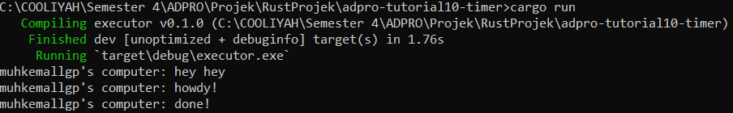
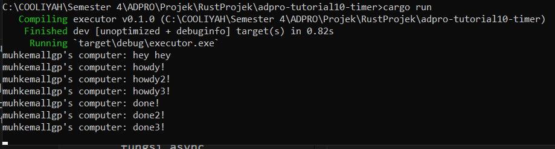

#### Nama : Muh. Kemal Lathif Galih Putra
#### NPM : 2206081225
#### Kelas : ADPRO - A
#### ASDOS : REN

# TUTORIAL - 9
## Refleksi

__1.2 Understanding how it works__

Berdasarkan hasil outputnya, dapat dipahami bahwa fungsi async akan dieksekusi di luar fungsi utama yang memanggilnya. Sebagai hasilnya, kemungkinan outpul " ... hey hey" akan muncul sebelum ".. howdy!" dan "... done!" karena kode "... hey hey" berada di luar fungsi async. 

Ini terjadi karena program akan melanjutkan eksekusi dan mencetak "hey hey" sedangkan fungsi async masih menunggu hasil dari future.

__1.3: Multiple Spawn and removing drop__

Dari keluaran yang disajikan, dapat teramati bahwa keberadaan banyak spawner menghasilkan peningkatan jumlah tugas yang dilakukan karena jumlah tugas yang dimasukkan ke dalam pengirim tugas bertambah seperti layaknya antrian pesan. Tidak menghentikan spawner mengakibatkan kelangsungan program karena dianggap masih akan ada pengiriman data oleh spawner. drop(spawner) sendiri menandakan akhir dari interaksi dan spawner akan ditutup.

Ketika suatu spawner memanggil fungsi spawn, tercipta tugas baru yang dialirkan ke pengirim tugas. Executor akan mengambil satu tugas dari pengirim tugas, menjalankannya, dan setelah itu mengambil tugas berikutnya hingga selesai dan spawner dihentikan, menandakan selesainya interaksi.

